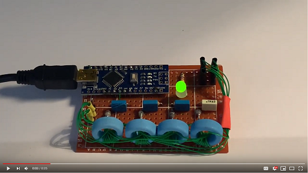
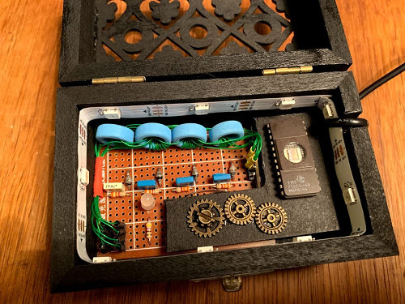
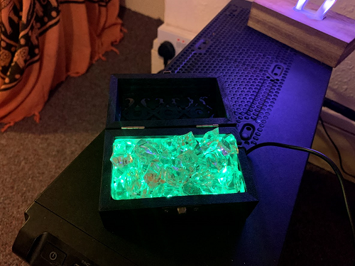
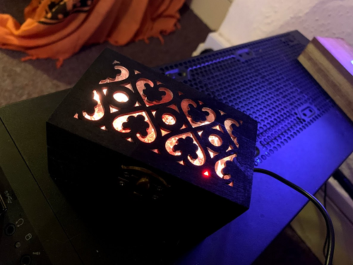
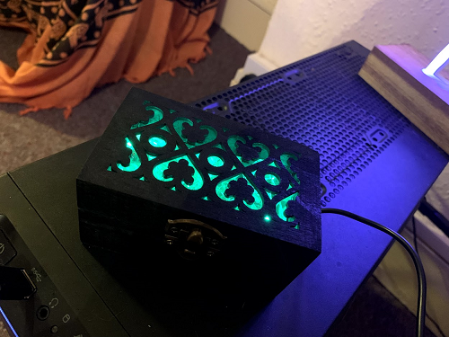

# Core Rope Memory

The 50th anniversary of the Apollo mission brought around lots of projects and talks about the technology that made the mission possible. One item that always fascinated me is "magnetic core memory", a type of RAM made of tiny ferrite beads that store a bit by being magnetized in one direction or another. A close relative of "magnetic core memory" is "core rope memory" which, instead, is a ROM.

I started to experiment with a toroid core I had in my parts bin and, after a bit of fumbling, came up with a single bit that could be driven directly by a microcontroller, whithout additional driver circuitry. Let's be clear, this is a bit stretching things as the drive line is a dead short to ground and relies solely on the current limiation of your microcontroller output circuitry. While this might not be best practice, and it surely isn't, it works beautifully at least on the Atmega 328. With other microcontrollers your mileage might vary from either not having enough current through the drive line to actually releasing a puff of smoke of death. Experiment at your own peril!


The concept is depicted in the diagram above. When Drive0 is excited with a pulse a few volts pulse is generated in the sense coil. The peak detector formed by the diode and the capacitor gives the microcontroller time to read the pulse after it's done driving the circuit. In this case, because Drive0 passes inside the core, the bit is detected as a "1". The second drive line in the example instead doesn't pass the core and so will not generate a pulse on the sense coil when it's excited, in this case the bit will be read as a "0".

The drive line can pass or skip several such cores allowing to read multiple bits in parallel. 

## The board ##

I made up a wire wrapped version with just 8 nibbles (4 bits words). This was more due to the lack of real-estate as well as of cores than because I thought 8 nibbles is a particularly usefuly ROM size. I tried to keep the wiring (reasonably) neatly arranged. You can see the final result below.


## Breathe! ##

What to do with 8 nibbles though? At first I thought to write some sort of ALU that would execute nibble sized instructions but, while it seemed a cool idea, it departed too much from the focus which was the actual ROM. Also I wanted something that I could just keep running there and would actually do something visible without the need to connect to the serial monitor. That's when I recalled reading a very interesting article by Sean Voisen on how to implement a breathing light (https://sean.voisen.org/blog/2011/10/breathing-led-with-arduino/), a concept that I never had a chance to use in one of my projects.

So, with a bit of fantasy, I imagined my core memory to contain vital data to keep a breathing LED alive. As long as the data coming back from the memory is uncorrupted the LED keeps breathing but as soon as a reading error occurs the LED will turn solid red and stop there forever.

While programming (ahem, wiring) the ROM I chose the pattern ```F0.5A.4E.43```. This is a good test pattern for the following reasons:

* Exercises all bits in both the on (0xF) and off (0x0) positions
* Has the highest number of bit flips possible btween a nibble and the following (0xF => 0x0)
* Has the highest number of alternating bit flips possible (0x5 => 0xA)
* Contains my initials (NC) encoded in ASCII (0x4E, 0x43)

The code drives the line two times around a full cycle in both directions. This is possible without a H-Bridge by tying both sides of the line to a digital output pin and then dirving the ends alternatively to 0 and 1. As noted above this shorts them and relies on the internal current limitation abilities of the microcontroller, not something I would do in a production design. 

I was able to read, most of the times, the bits correctly in all their permuations with a single pulse on the drive line but encountered the odd reading error here and there. A double pulse drives the voltage on the peak detector higher and proves to be very robust.

I originally had a reistor (still visible on the board image) in parallel to the peak detector capacitor to allow it to discharge. However this imposes time constraints on the reading time of consecutive nibbles. I eventually did away with the resistors completely and just turned the sense pins to outputs and driven them low for few milliseconds to discharge the capacitors before starting to pulse the drive line. This allows to read the memory at higer speeds and gets rid of any read error.

The video shows the light breathing away and, given I haven't had reading errors in hours of tests, me shorting two drive pins to simulate an error, after all shorts on those pins are the rule, so why not. 

[](https://www.youtube.com/watch?v=8H_4KBkwSY4)

## A more permanent installation ##

I wasn't satisfied with just the bare PCB sitting on my desk breathing and, after a good week of uninterrupted test, I began to suspect I would never see a reading error anyway so I decided to over-engineer a bit the whole idea.

Firstly I added a RGB LED strip and enclosed the board in a wooden box with a grate laser-cut on the cover. The effect was reasonably pleasant but I wasn't fully satisfied till I hid the most modern bit (the Arduino) with a steampunked plate with couple of cogs and an EEPROM which, needless to say, is not part of the circuitry. I finally sprinkled a good amount of acrylic crystals over the electronics which improved the visual effect considerably. Finally I changed the solid red for the memory reading error to an animation simulation fire flickering.



The inside of the box.



The acrylic gems glowing in emerald green.



On fire.



Calmly breathing in normal opeation.

## The final iteration (?) ##

I was still left with the issue that a memory error would probably never occour, unless I did externally apply a magnet so strong to saturate one or more of the cores. Wanting to do something else to the device I added a CLI interface, via serial port, to it and implemented a crude set of commands to manipulate memory. I memory mapped some of the parts such as the LED Controller and elected some special EEPROM (Arduino EEPROM, not the one glued to the plate for shows) memory locations to act as control registers to bank in/out the rope ROM itself, the EEPROM and a bit of RAM. I am coming up with new things to memory map from time to time, the current memory looks like in the table below.

````
00-2F 	RAM (48 bytes)
00-1F 	EEPROM (32 bytes, shadows RAM)
00-04 	Core Rope Memory (4 bytes, shadows EEPROM and RAM)

0A      CONFIG
          bit7 (RMOFF) Core Rope ROM OFF
          bit6 (EEOFF) EEPROM OFF

0B      STATUS
         bit0 (RMERR) Core Rope ROM read error

0C      LIGHTCTRL
          00-FF Light brightness
````

**Dump memory content**

````
dump [from] [to]

>d 0 $3f
00 - F0.5A.4E.43.FF.FF.FF.FF.FF.FF.00.00.FF.FF.FF.FF
10 - FF.FF.FF.FF.FA.FF.FF.FF.FF.FF.FF.FF.FF.FF.FF.FF
20 - 00.00.00.00.00.00.00.00.00.00.00.00.00.00.00.00
30 - 00.00.00.00.00.00.00.00.00.00.00.00.00.00.00.00

````

**Read memory content**

````
read [addr] 

>r $3f
00
````
**Write to memory**

````
write [addr] [value]

>w $3f $ff
````
Note: writing to any location *always* writes also to the shadowed memory, regardless of memory configuration. So, for instance, writing to $00 will write in EEPROM and RAM, clearly not in the Core ROM as it's read only.

## Notes ##

I haven't produced a full schematic, however the code should make it self explanatory where things are connected. The sense coils are 10 windings which seems to work fine at least for the ferrite type I'm using. The outputs of the 4 peak detectors go to pins A1-A3 while the driving lines are all wired from D7 on one side to pins D2, D4, D5, D6, D8, D9, D10, D11. Pardon the odd arrangement, I needed D3 for the LED as D2 can't PWM on the Nano and I was too lazy to shuffle all the other wiring around.

I had an odd issue when attempting to excite a drive line using D12 and couldn't get consistent results. I didn't dig further into this but I suspect the hardware driving this pin might be different and have a different current limitation so, perhaps, this is really the only possible arrangement with 8 drive lines if a PWM pin is desired for the LED.
