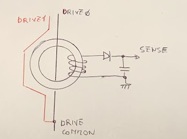
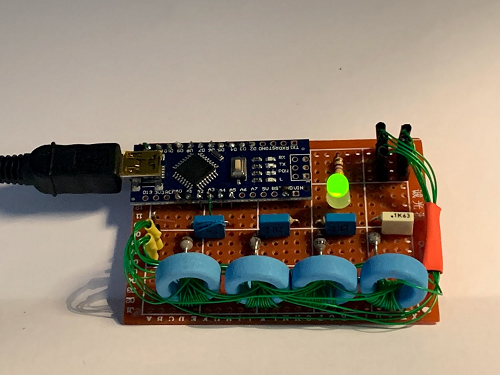

# Core Rope Memory

The 50th anniversary of the Apollo mission brought around lots of projects and talks about the technology that made the mission possible. One item that always fascinated me is "magnetic core memory", a type of RAM made of tiny ferrite beads that store a bit by being magnetized in one direction or another. A close relative of "magnetic core memory" is "core rope memory" which, instead, is a ROM.

I started to experiment with a toroid core I had in my parts bin and, after a bit of fumbling, came up with a single bit that could be driven directly by a microcontroller, whithout additional driver circuitry. Let's be clear, this is a bit stretching things as the drive line is a dead short to ground and relies solely on the current limiation of your microcontroller output circuitry. While this might not be best practice, and it surely isn't, it works beautifully at least on the Atmega 328. With other microcontrollers your mileage might vary from either not having enough current through the drive line to actually releasing a puff of smoke of death. Experiment at your own peril!



The concept in depicted in the diagram above). When Drive0 is excited with a pulse a few volts pulse is generated in the sense coil. The peak detector formed by the diode and the capacitor gives the microcontroller time to read the pulse after it's done driving the circuit. In this case, because Drive0 passes inside the core, the bit is detected as a "1". The second drive line in the example instead doesn't pass the core and so will not generate a pulse on the sense coil when it's excited, in this case the bit will be read as a "0".

The drive line can pass or skip several such cores allowing to read multiple bits in parallel. 

## The board ##

I made up a wire wrapped version with just 8 nibbles (4 bits words). This was more due to the lack of real-estate as well as of cores than because I thought 8 nibbles is a particularly usefuly ROM size. I tried to keep the wiring (reasonably) neatly arranged. You can see the final result below.



## Breathe! ##

What to do with 8 nibbles though? At first I thought to write some sort of ALU that would execute nibble sized instructions but, while it seemed a cool idea, it departed too much from the focus which was the actual ROM. Also I wanted something that I could just keep running there and would actually do something visible without the need to connect to the serial monitor. That's when I recalled reading a very interesting article by Sean Voisen on how to implement a breathing light (https://sean.voisen.org/blog/2011/10/breathing-led-with-arduino/), a concept that I never had a chance to use in one of my projects.

So, with a bit of fantasy, I imagined my core memory to contain vital data to keep a breathing LED alive. As long as the data coming back from the memory is uncorrupted the LED keeps breathing but as soon as a reading error occurs the LED will turn solid RED and stop there forever.

While programming (ahem, wiring) the ROM I chose the pattern ```F0.5A.4E.43```. This is a good test pattern for the following reasons:

* Exercises all bits in both the on (0xF) and off (0x0) positions
* Has the highest number of bit flips possible (0xF => 0x0, 0x5 => 0xA)
* Contains my initials (NC) encoded in ASCII (0x4E, 0x43)

The code drives the line two times around a full cycle in both directions. This is possible without an H-Bridge by tying both sides of the line to a digital output pin and then dirving the ends alternatively to 0 and 1. As noted above this shorts them and relies on the internal current limitation abilities of the microcontroller, not somthing I would do in a production design. 

I was able to read, most of the times, the bits correctly in all their permuations with a single pulse on the drive line but encountered the odd reading error here and there. A double pulse drives the voltage on the peak detector higher and provided very robust.

I originally had a reistor in parallel to the peak detector capacitor to allow it to discharge. However this imposes time constraints on the reading time. I eventually did away with the resistors completely and just turned the sense pins to outputs and driven them low for few milliseconds to discharge the capacitor before starting to pulse the drive line. This allowed to read the memory at considerably higer speeds and got rid of any read error.


